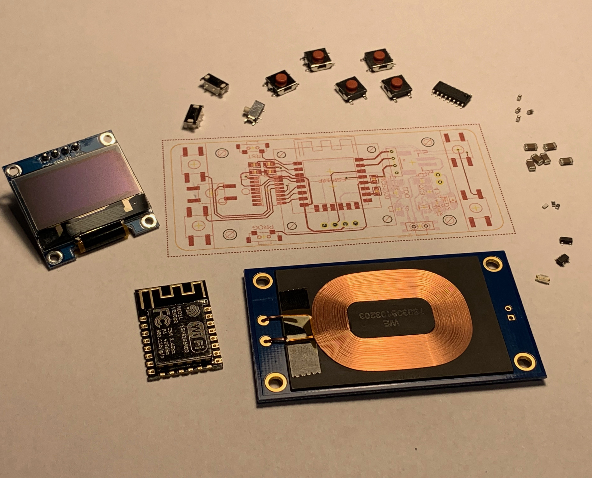
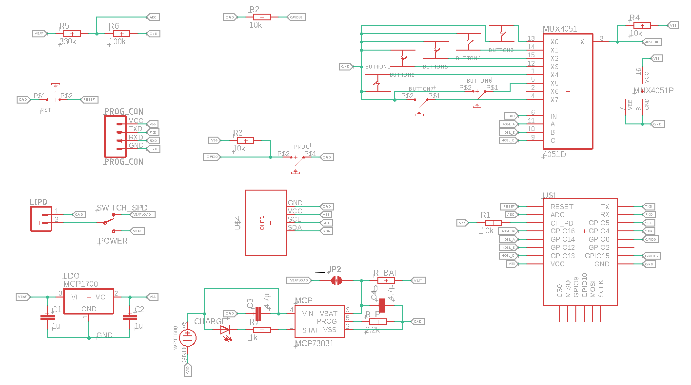
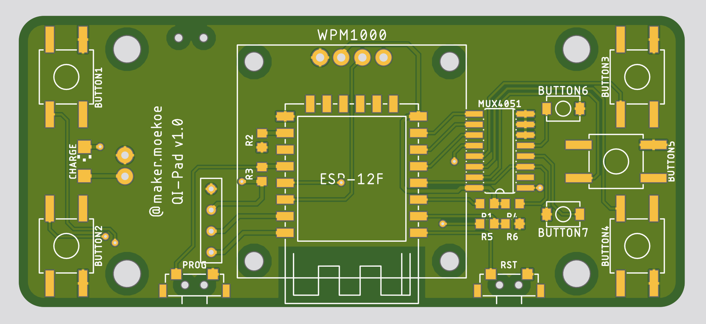
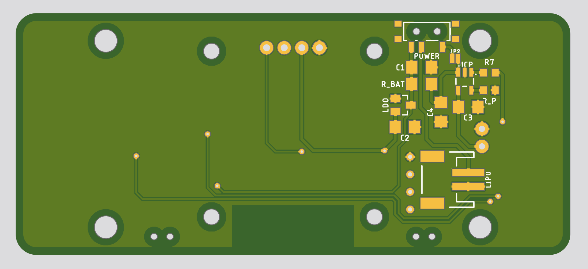

# Qi-pad

Basic idea of the Qi-pad leads back to the feedback from the maker community. Some people who were interested in smart home applications and in my dashbutton project want to have something similar, but with a few more inputs - e.g. more buttons or something like that. Compared to the dashbutton, the Qi-pad consists of more buttons, an extra oled display, a bigger lipo battery and last but not least a [Qi wireless power transfer module](https://www.wpte.ca/product-page/wpm1000-5w-wireless-power-receiver-module) for charging, which is why it's called like this.

__TODO__

## Requirements

## Schematics and PCB

[Design in Autodesk Eagle](https://www.instagram.com/p/BtY8-AnIJQN/?utm_source=ig_web_button_share_sheet)

__Version 1__

## 3D printed case
